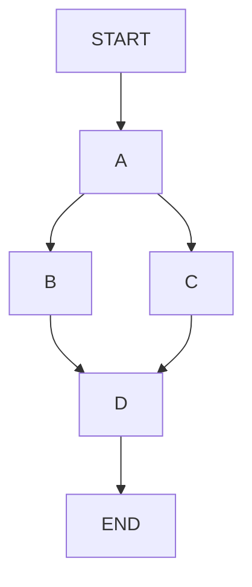

# 🚀 Workflows in LangGraph: Sequential & Parallel

LangGraph allows you to build workflows in two major ways:

1. **Sequential Workflow** → Nodes execute one after another.
2. **Parallel Workflow** → Multiple nodes execute simultaneously.

Think of it like:

```text
Sequential:
A → B → C → D

Parallel:
      A
    / | \
   B  C  D
    \ | /
      E
```

---

# 1️⃣ Sequential Workflows

A sequential workflow executes nodes in a fixed order.

Each node completes before the next node starts.

---

## Example

```text
START
  ↓
Load Data
  ↓
Process Data
  ↓
Generate Report
  ↓
END
```

Execution moves step-by-step.

---

## Real World Example

Imagine a Resume Analyzer:

```text
Upload Resume
      ↓
Extract Text
      ↓
Analyze Skills
      ↓
Generate Feedback
```

Every step depends on the previous step.

---

# 2️⃣ add_edge()

`add_edge()` is used to connect nodes.

It tells LangGraph:

> "After Node A finishes, execute Node B."

---

## Syntax

```python
graph.add_edge(
    "node_a",
    "node_b"
)
```

---

## Example

```python
graph.add_edge(
    "extract_text",
    "analyze_resume"
)

graph.add_edge(
    "analyze_resume",
    "generate_feedback"
)
```

---

## Visualization

```text
Extract Text
      ↓
Analyze Resume
      ↓
Generate Feedback
```

---

# 3️⃣ START and END

LangGraph provides two built-in special nodes:

* START
* END

These define:

```text
Workflow Start
Workflow Finish
```

---

## START

Execution begins here.

```python
from langgraph.graph import START
```

Example:

```python
graph.add_edge(
    START,
    "extract_text"
)
```

---

## END

Execution stops here.

```python
from langgraph.graph import END
```

Example:

```python
graph.add_edge(
    "generate_feedback",
    END
)
```

---

## Complete Flow

```text
START
   ↓
Extract Text
   ↓
Analyze Resume
   ↓
Generate Feedback
   ↓
END
```

---

# 4️⃣ State Passing

The most important concept in LangGraph.

Nodes communicate through a shared state.

---

## State Definition

```python
from typing import TypedDict

class State(TypedDict):
    text: str
    analysis: str
```

---

## Initial State

```python
{
    "text": "",
    "analysis": ""
}
```

---

## Node Reads State

```python
def analyze(state):

    text = state["text"]

    result = f"Analyzed: {text}"

    return {
        "analysis": result
    }
```

---

## State Flow

Before:

```python
{
    "text": "Resume Data"
}
```

After:

```python
{
    "text": "Resume Data",
    "analysis": "Analyzed: Resume Data"
}
```

---

## Important Rule

Every node:

### Receives

```python
state
```

### Returns

```python
updated_state
```

---

# 5️⃣ Parallel Workflows

Sequential workflows are not always efficient.

Sometimes multiple tasks can run independently.

Example:

```text
Analyze Resume
       ↓
 ┌─────┼─────┐
 ↓     ↓     ↓
Skills Experience Education
 └─────┼─────┘
       ↓
 Generate Report
```

All three analyses can run simultaneously.

---

## Why Parallel?

Benefits:

✅ Faster execution

✅ Independent processing

✅ Better scalability

---

# 6️⃣ Fan-Out (Parallel Branching)

Fan-out means:

> One node triggers multiple nodes.

---

## Visualization

```text
          A
        / | \
       B  C  D
```

A finishes and launches:

* B
* C
* D

simultaneously.

---

## Example

```python
graph.add_edge(
    "analyze_resume",
    "skill_analysis"
)

graph.add_edge(
    "analyze_resume",
    "education_analysis"
)

graph.add_edge(
    "analyze_resume",
    "experience_analysis"
)
```

---

## Execution

```text
Analyze Resume
      ↓
 ┌────┼────┐
 ↓    ↓    ↓
Skill Edu Exp
```

---

# 7️⃣ add_edge() with Multiple Targets

Conceptually:

```text
A
├──→ B
├──→ C
└──→ D
```

Each edge starts a new branch.

Example:

```python
graph.add_edge("A", "B")
graph.add_edge("A", "C")
graph.add_edge("A", "D")
```

This creates parallel execution.

---

# 8️⃣ Fan-In (Merging Branches)

After parallel execution:

```text
B
 \
  \
   E
  /
 /
C
```

Outputs are merged.

This process is called:

# Fan-In

---

## Example

```text
         A
       / | \
      B  C  D
       \ | /
         E
```

---

### Meaning

E waits for:

* B
* C
* D

to finish.

Then E executes.

---

## Real Example

```text
Skill Analysis
Experience Analysis
Education Analysis
          ↓
Combine Results
```

---

# 9️⃣ Problem with Parallel Writes

Suppose:

```python
state = {
    "results": []
}
```

Branch B:

```python
["skills"]
```

Branch C:

```python
["experience"]
```

Branch D:

```python
["education"]
```

All write to the same field.

Question:

```text
How should these results be merged?
```

LangGraph needs instructions.

---

# 🔟 Reducer Functions

Reducers define:

> How parallel outputs should be combined.

---

## Example

```python
import operator
```

---

### Using operator.add

```python
operator.add
```

means:

```python
[1] + [2] + [3]
```

becomes:

```python
[1,2,3]
```

---

## Example

Branch outputs:

```python
["skills"]
```

```python
["experience"]
```

```python
["education"]
```

Reducer:

```python
operator.add
```

Result:

```python
[
 "skills",
 "experience",
 "education"
]
```

---

# 1️⃣1️⃣ Annotated State Fields

LangGraph uses Python's:

```python
Annotated
```

to specify reducers.

---

## Syntax

```python
from typing import Annotated
import operator
```

---

### State Schema

```python
class State(TypedDict):

    results: Annotated[
        list,
        operator.add
    ]
```

---

## Meaning

```text
Multiple nodes may write to "results"

Merge them using operator.add
```

---

## Visualization

```text
Branch A
   ↓
["skills"]

Branch B
   ↓
["experience"]

Branch C
   ↓
["education"]

Reducer
   ↓

[
 skills,
 experience,
 education
]
```

---

# 1️⃣2️⃣ Custom Reducers

Sometimes `operator.add` isn't enough.

You can create your own reducer.

---

## Example

```python
def merge_results(
    old,
    new
):
    return old + new
```

---

## State

```python
class State(TypedDict):

    results: Annotated[
        list,
        merge_results
    ]
```

---

## Example Use Cases

### Remove Duplicates

```python
def unique_merge(
    old,
    new
):

    return list(
        set(old + new)
    )
```

---

### Merge Dictionaries

```python
def merge_dicts(
    old,
    new
):

    return {
        **old,
        **new
    }
```

---

# 1️⃣3️⃣ Visualizing Graph Structure

Large graphs become difficult to understand.

LangGraph provides visualization.

---

## Method

```python
graph.get_graph()
```

returns graph representation.

---

## Mermaid Diagram

```python
graph.get_graph().draw_mermaid()
```

---

## Example Output



---

## Visualization

```text
START
   ↓
   A
  / \
 B   C
  \ /
   D
   ↓
  END
```

---

# Complete Sequential Workflow Example

```python
from typing import TypedDict
from langgraph.graph import StateGraph, START, END

class State(TypedDict):
    text: str

def step1(state):
    return {"text": state["text"] + " A"}

def step2(state):
    return {"text": state["text"] + " B"}

graph = StateGraph(State)

graph.add_node("step1", step1)
graph.add_node("step2", step2)

graph.add_edge(START, "step1")
graph.add_edge("step1", "step2")
graph.add_edge("step2", END)

workflow = graph.compile()

result = workflow.invoke({
    "text": ""
})

print(result)
```

---

# Complete Parallel Workflow Example

```python
from typing import TypedDict, Annotated
import operator

class State(TypedDict):

    results: Annotated[
        list,
        operator.add
    ]

def skill(state):
    return {"results": ["skills"]}

def experience(state):
    return {"results": ["experience"]}

def education(state):
    return {"results": ["education"]}
```

Execution:

```text
          START
             ↓
       Analyze Resume
        /   |   \
       ↓    ↓    ↓
   Skills Exp Edu
        \   |   /
            ↓
      Combine Results
             ↓
            END
```

Final State:

```python
{
    "results": [
        "skills",
        "experience",
        "education"
    ]
}
```

---

# 🎯 Interview Quick Revision

### Sequential Workflow

```text
A → B → C
```

Nodes execute one after another.

---

### add_edge()

Connects nodes.

```python
graph.add_edge("A", "B")
```

---

### START

Built-in entry point.

---

### END

Built-in exit point.

---

### State Passing

Nodes read and update shared state.

---

### Parallel Workflow

```text
      A
    / | \
   B  C  D
```

Multiple nodes run simultaneously.

---

### Fan-Out

One node launches multiple branches.

---

### Fan-In

Multiple branches merge into one node.

---

### Reducer

Combines parallel outputs.

Examples:

```python
operator.add
```

or custom merge functions.

---

### Annotated State

```python
Annotated[list, operator.add]
```

Defines merge strategy.

---

### Graph Visualization

```python
graph.get_graph().draw_mermaid()
```

Generates Mermaid diagrams for workflow visualization.

---

# 🧠 Memory Trick

```text
Sequential Workflow
= Train Track 🚂

A → B → C → D


Parallel Workflow
= Highway Network 🛣️

      A
    / | \
   B  C  D
    \ | /
      E
```

**Sequential = One Path**
**Parallel = Multiple Paths + Merge**
